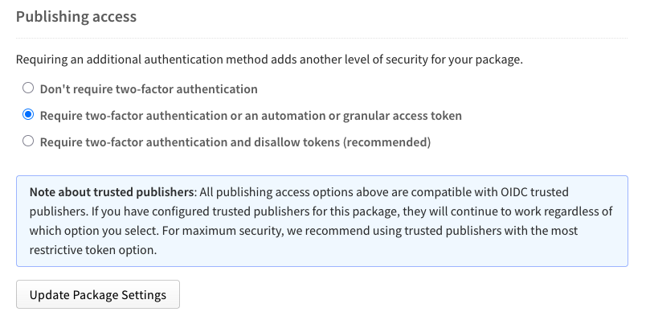

# Testing goreleaser's npm Trusted Publishing flow

Testing for [Goreleaser-pro Issue #33](https://github.com/goreleaser/goreleaser-pro/discussions/33) against [@frenchi/test-goreleaser-npm-trusted](https://www.npmjs.com/package/@frenchi/test-goreleaser-npm-trusted) and [@frenchi/test-goreleaser-npm-trusted-control](https://www.npmjs.com/package/@frenchi/test-goreleaser-npm-trusted)

## Preconditions

- valid `GORELEASER_KEY` set in all cases
- For base case (`v0.0.1`) no token or OIDC configuration exists, expect failure.
- For standard publishing flow (`v0.0.2` & `v0.0.3`) `NPM_TOKEN` exists with package publishing permissions.
- For OIDC scenario (`v0.0.4`): remove `NODE_AUTH_TOKEN` or `NPM_TOKEN` from the github environment secrets. NPM Trusted Publishers configured for the repo.

from: https://www.npmjs.com/package/@frenchi/test-goreleaser-npm-trusted/access

## Testing matrix

Run a tag-triggered release for each scenario and capture logs.

| Tag    | Scenario                                    | NPM_TOKEN | Publishing access (package setting)                                         | Setup (summary)                                                              |
| ------ | ------------------------------------------- | --------- | --------------------------------------------------------------------------- | ---------------------------------------------------------------------------- |
| v0.0.1 | Any; no token (standard flow)               | No        | Any                                                                         | Do not set `NPM_TOKEN`.                                                      |
| v0.0.2 | Tokens allowed; automation token present    | Yes       | Require two-factor authentication or an automation or granular access token | Package allows tokens; export an automation token (e.g., `NPM_TOKEN`).       |
| v0.0.3 | Tokens disallowed; automation token present | Yes       | Require two-factor authentication and disallow tokens (recommended)         | Package: Require 2FA and disallow tokens; keep `NPM_TOKEN` set.              |
| v0.0.4 | Tokens disallowed; no token (OIDC)          | No        | Require two-factor authentication and disallow tokens (recommended)         | Remove token envs; rely on OIDC; ensure preconditions and Trusted Publisher. |

Control runs: for each tag above, also cut a matching `-control` tag (e.g., `v0.0.1-control`) to trigger a direct npm publish via `control.yml`. For GoReleaser runs, cut matching `-goreleaser` tags trigger the testing workflow: release.yml

## Results

| Tag    | Expected outcome                                                     | Control run                                                                                                                                                                   | Observed outcome                                                                                        | Test passed? |
| ------ | -------------------------------------------------------------------- | ----------------------------------------------------------------------------------------------------------------------------------------------------------------------------- | ------------------------------------------------------------------------------------------------------- | ------------ |
| v0.0.1 | Publish fails with ENEEDAUTH (no auth provided).                     | [logs](https://github.com/frenchi/test-goreleaser-npm-trusted/actions/runs/17902305355/job/50897305627)                                                                       | [logs](https://github.com/frenchi/test-goreleaser-npm-trusted/actions/runs/17902821877/job/50898605291) | ✅           |
| v0.0.2 | Publish succeeds via token (baseline).                               | [logs](https://github.com/frenchi/test-goreleaser-npm-trusted/actions/runs/17903146406) published: https://www.npmjs.com/package/@frenchi/test-goreleaser-npm-trusted-control | [logs]()                                                                                                |              |
| v0.0.3 | 403 error: 2FA required but an automation token was specified.       | [logs]()                                                                                                                                                                      | [logs]()                                                                                                |              |
| v0.0.4 | Publish succeeds; provenance shown for public repo + public package. | [logs]()                                                                                                                                                                      | [logs]()                                                                                                |              |

## Diagnostics (if ENEEDAUTH)

- Confirm workflow filename in npm Trusted Publisher matches exactly (case-sensitive, includes `.yml`).
- Ensure `permissions: id-token: write` exists and is not overridden at job level.
- Confirm `actions/setup-node@v4` runs before GoReleaser and sets the registry.
- Ensure npm version ≥ 11.5.1 and Node 20 (check logged versions).
- Ensure no `NODE_AUTH_TOKEN`/`NPM_TOKEN` are present in the environment for OIDC runs.
- If a direct `npm publish` control step succeeds with OIDC but GoReleaser fails, capture GoReleaser logs and open an issue with a minimal repro.

## References

- npm Trusted Publishing (OIDC): https://docs.npmjs.com/trusted-publishers
- GoReleaser npm pipe: https://goreleaser.com/customization/npm/
- GoReleaser on GitHub Actions: https://goreleaser.com/ci/actions/
- Discussion: https://github.com/goreleaser/goreleaser-pro/discussions/33
